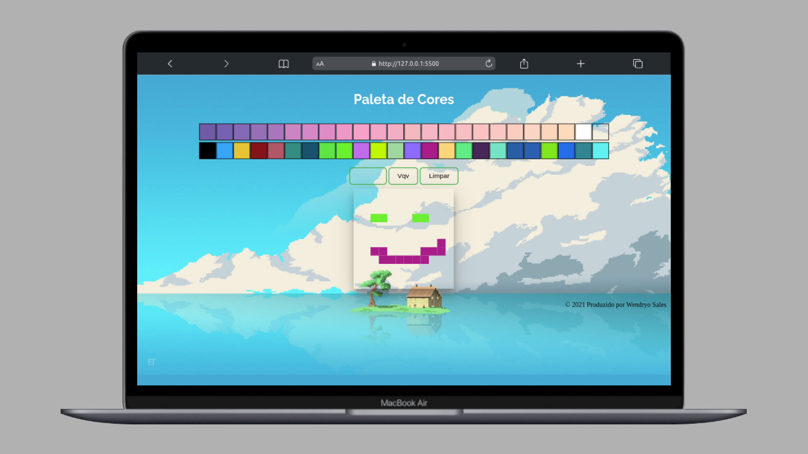

# Pixel Art

Quadro de pinturas pixeladas, onde é possível escolher
a cor com base em uma paleta randomizada e outra fixa.
## Stacks

**Front-end:** HTML, CSS e JavaScript.


## Rodando localmente

Clone o projeto

```bash
  git clone git@github.com:wendryosales/pixels-art.git
```

Entre no diretório do projeto

```bash
  cd pixels-art
```

Abra o arquivo Index.html com o seu navegador

## Screenshots




## Author

- [@wendryosales](https://www.linkedin.com/in/wendryosales/)

